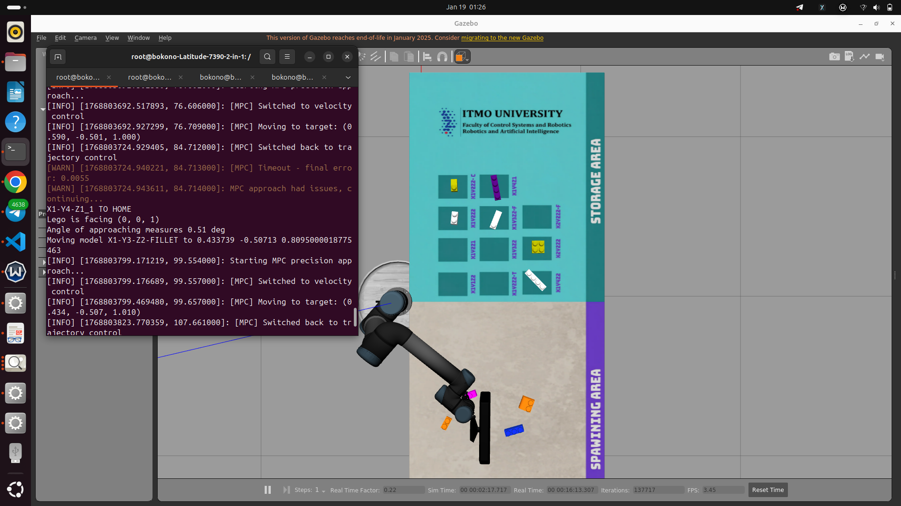

# Sensory-Driven Vision-Based Control for Robotic Manipulation

This project implements a robust pick-and-place system for a robotic manipulator (UR5) using a hybrid control strategy. The core objective is to achieve high-precision manipulation by combining standard trajectory planning for global movement with a custom velocity-based controller (referred to as MPC) for terminal accuracy.

## Project Overview

The system consists of four main components:

1.  **Gazebo Simulation**: Simulates the UR5 robot, a table, and Lego bricks.
2.  **Level Manager**: Spawns Lego bricks in random or predefined configurations on the table.
3.  **Vision Node**: Uses a camera sensor and YOLOv5 to detect Lego bricks, classify them, and estimate their pose (position and orientation).
4.  **Motion Planning**: Controls the UR5 arm to pick up detected bricks and stack them according to a build plan.
5.  **Obstacles**: Optional spawning of obstacles to test dynamic path planning.

### Simulation Environment & Demo

<p align="center">
  
  <br>
  <em>Figure 1: The Gazebo simulation environment featuring the UR5 robot, table, and Lego bricks.</em>
  <br><br>
  
  <br>
  <em>Figure 2: Pick-and-place execution using the hybrid control strategy.</em>
</p>

## System Architecture

- **Robot Platform**: Universal Robots UR5 (6-DOF manipulator).
- **Simulation Environment**: Gazebo with `gazebo_ros_link_attacher` for grasping simulation.
- **Middleware**: ROS Noetic (Python 3).
- **Control Interface**: `ros_control` managing `trajectory_controller` and `joint_group_vel_controller`.

## Control Strategy

The system utilizes a **Hybrid Control Architecture** that dynamically switches between two distinct controllers based on the task phase.

### A. ArmController (Trajectory Control)

- **Type**: Position-based Joint Trajectory Controller.
- **Usage**: Used for large, coarse movements, moving to home positions, and vertical descent/ascent.
- **Mechanism**: Generates quintic spline trajectories to ensure smooth velocity and acceleration profiles. The trajectory $q(t)$ is defined as:
  $$q(t) = a_0 + a_1 t + a_2 t^2 + a_3 t^3 + a_4 t^4 + a_5 t^5$$
- **Role**: Ensures safe navigation and obstacle avoidance during the transport phase.

### B. MPCController (Precision Velocity Control)

- **Type**: Velocity-based PID Feedback Controller (running at 100Hz).
- **Usage**: Used exclusively for the "Precision Approach" phase to align the end-effector with the target object.
- **Mechanism**:
  - Calculates real-time joint errors based on Inverse Kinematics (IK).
  - Computes required joint velocities using a tuned PID loop (`Kp=15.0`, `Ki=1.5`, `Kd=0.6`). The control law is given by:
    $$u(t) = K_p e(t) + K_i \int_{0}^{t} e(\tau)d\tau + K_d \frac{de(t)}{dt}$$
  - Handles joint wrapping (normalization to `[-pi, pi]`) and velocity saturation (`+/- 1.5 rad/s`).
- **Role**: Eliminates steady-state error and achieves sub-millimeter positioning accuracy (< 2mm tolerance) which standard trajectory planners often struggle to achieve quickly.

## Motion Planning Workflow

The `motion_planning.py` script orchestrates the task execution through the following state machine:

1.  **Initialization**: Initialize Kinematics and Gripper action clients; wait for object detection.
2.  **Object Approach**:
    - **Coarse Approach**: `ArmController` moves the robot to a "Safe Height" (`z + 0.2m`) above the target.
    - **Controller Switch**: System switches hardware interface from `trajectory_controller` to `joint_group_vel_controller`.
    - **Precision Alignment (MPC)**: `MPCController` servos the robot to minimize X/Y error while maintaining height.
      - _Success Criteria_: Error norm $||e|| < 2mm$ within 8 seconds.
    - **State Sync**: `ArmController` synchronizes its internal state with the actual robot position left by the MPC.
3.  **Manipulation**: Descent, Grasp, Transport, and Place.

## Performance Analysis

We developed a suite of analysis tools to validate the hybrid strategy.

### Data Logging

Both controllers automatically log performance metrics to CSV files in `catkin_ws/`:

- **Metrics**: Timestamp, Target Pose (XYZ), Actual Pose (XYZ), Position Error, Orientation Error, and Joint Velocities.

### Visualization Tools

A comprehensive Python script (`plot_mpc_results.py`) is provided to analyze the logs:

1.  **Trajectory Tracking**: Visualizes Target vs. Actual paths in X, Y, and Z.
2.  **Error Convergence**: Log-scale plots showing how quickly the error minimizes.
3.  **Control Effort**: Plots joint velocities to ensure smoothness and safety.
4.  **Comparison Mode**: Allows overlaying results from the `ArmController` and `MPCController` to identify the "Best" controller based on final accuracy.

## Prerequisites

- **OS**: Ubuntu 20.04 (Focal Fossa) or compatible Linux distribution.
- **Docker**: For running the simulation in an isolated environment.
- **NVIDIA Drivers (Optional)**: For GPU acceleration (though the current setup uses CPU for PyTorch).

## Installation & Setup

The entire environment is containerized using Docker. A helper script is provided to build the image, install dependencies, and launch the container.

1.  **Clone the Repository** (if not already done):

    ```bash
    git clone <repository_url>
    cd "Sensory-Driven Vision-Based Control for Robotic Manipulation"
    ```

2.  **Run the Simulation Script**:
    Navigate to the scripts directory and run the setup script. This script will:
    - Build the Docker image.
    - Start the container.
    - Install system dependencies (ROS Noetic, Gazebo, etc.).
    - Build the Catkin workspace.
    - Install Python dependencies (PyTorch, YOLOv5, Pandas, etc.).

    ```bash
    cd catkin_ws/src/vision/scripts
    ./run_simulation.sh
    ```

    _Note: The first run will take some time to download and install all dependencies._

## Running the Simulation

Once the setup script completes, it will output instructions on how to run the individual components. You will need **up to five separate terminal windows**.

For each terminal, first connect to the running container:

```bash
docker start ur5_container
 xhost +local:root
```

```bash
docker exec -it -e DISPLAY=$DISPLAY ur5_container bash
```

Then run the specific command for that component.

### Terminal 1: Gazebo World

Launches the simulation environment with the robot and table.

```bash
source /root/catkin_ws/devel/setup.bash
roslaunch levelManager lego_world.launch
```

_Wait for Gazebo to fully load before proceeding._

### Terminal 2: Level Manager

Spawns the Lego bricks. You can choose a level (1-4).

```bash
source /root/catkin_ws/devel/setup.bash
rosrun levelManager levelManager.py -l 1
```

- `-l 1`: Spawns a random brick.
- `-l 2`: Spawns all brick types.
- `-l 4`: Spawns bricks for a specific construction.

### Terminal 3: Motion Planning

Starts the robot controller to pick and place bricks. Note: Run this **before** the vision node so it is ready to receive detections.

```bash
source /root/catkin_ws/devel/setup.bash
rosservice call /gazebo/unpause_physics
rosrun motion_planning motion_planning.py
```

### Terminal 4: Vision Node

Starts the computer vision processing.

```bash
source /root/catkin_ws/devel/setup.bash
rosrun vision lego-vision.py -show
```

    `-show`: Displays a window with the camera feed and detection overlays.

### Terminal 5: Spawn Obstacles (Optional)

To test path planning capabilities, spawn a static obstacle in the workspace.

```bash
source /root/catkin_ws/devel/setup.bash
rosrun motion_planning spawn_obstacle.py
```

## Troubleshooting

- **"No module named ..."**: If you encounter missing Python modules, ensure the `run_simulation.sh` script has finished completely. You can manually install packages inside the container using `pip3 install <package_name>`.
- **Gazebo GUI issues**: If Gazebo doesn't show up, ensure you have allowed X11 forwarding (`xhost +`) on your host machine, which the script attempts to do automatically.
- **Controller Spawner Errors**: Occasionally, Gazebo might fail to spawn controllers. Restarting the simulation (Terminal 1) usually fixes this.

## Credits & License

This project is based on the work by Pietro Lechthaler: [UR5-Pick-and-Place-Simulation](https://github.com/pietrolechthaler/UR5-Pick-and-Place-Simulation).

MIT License

Copyright (c) 2022 Pietro Lechthaler

Permission is hereby granted, free of charge, to any person obtaining a copy
of this software and associated documentation files (the "Software"), to deal
in the Software without restriction, including without limitation the rights
to use, copy, modify, merge, publish, distribute, sublicense, and/or sell
copies of the Software, and to permit persons to whom the Software is
furnished to do so, subject to the following conditions:

The above copyright notice and this permission notice shall be included in all
copies or substantial portions of the Software.

THE SOFTWARE IS PROVIDED "AS IS", WITHOUT WARRANTY OF ANY KIND, EXPRESS OR
IMPLIED, INCLUDING BUT NOT LIMITED TO THE WARRANTIES OF MERCHANTABILITY,
FITNESS FOR A PARTICULAR PURPOSE AND NONINFRINGEMENT. IN NO EVENT SHALL THE
AUTHORS OR COPYRIGHT HOLDERS BE LIABLE FOR ANY CLAIM, DAMAGES OR OTHER
LIABILITY, WHETHER IN AN ACTION OF CONTRACT, TORT OR OTHERWISE, ARISING FROM,
OUT OF OR IN CONNECTION WITH THE SOFTWARE OR THE USE OR OTHER DEALINGS IN THE
SOFTWARE.
